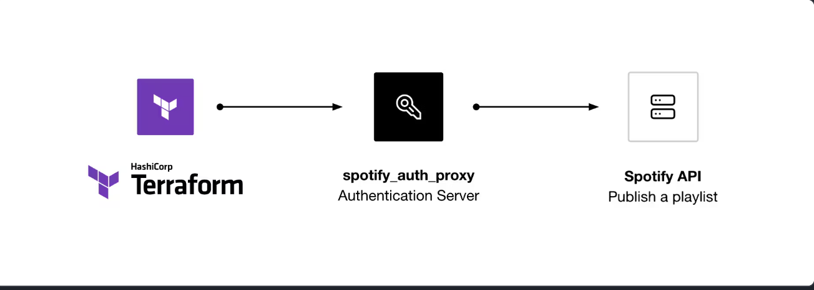
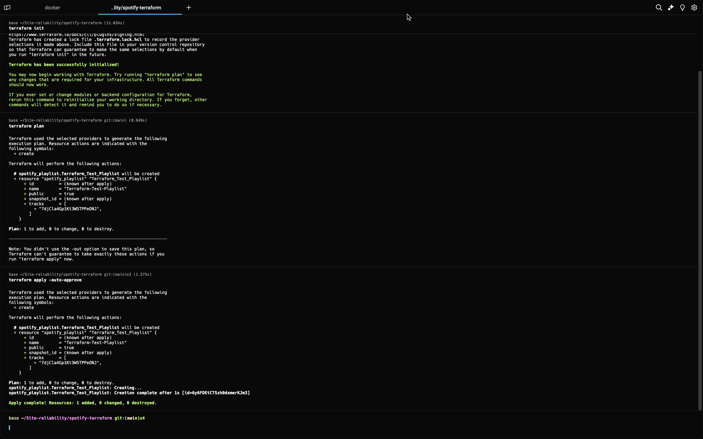
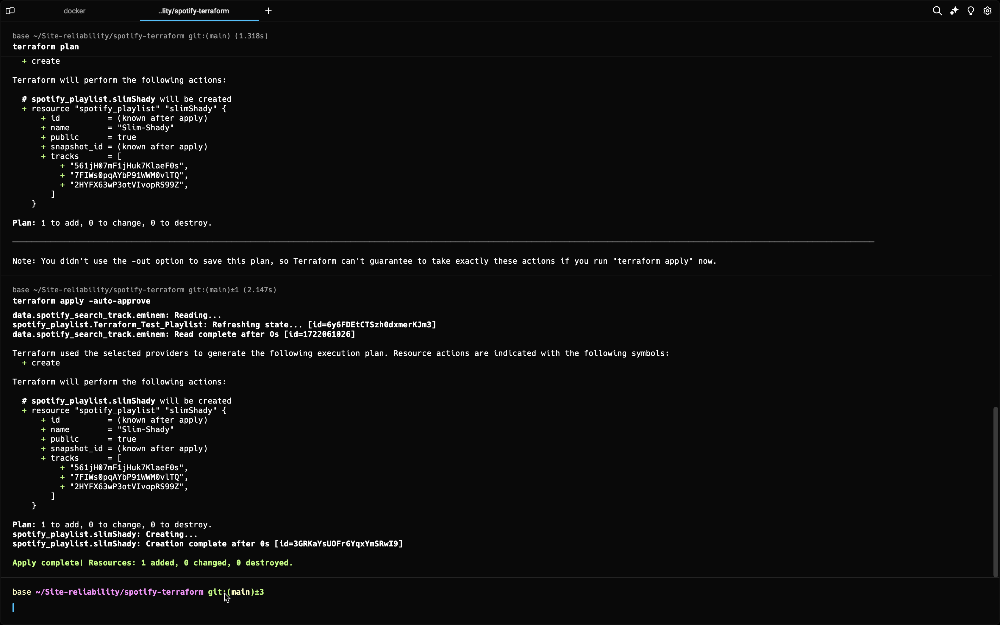
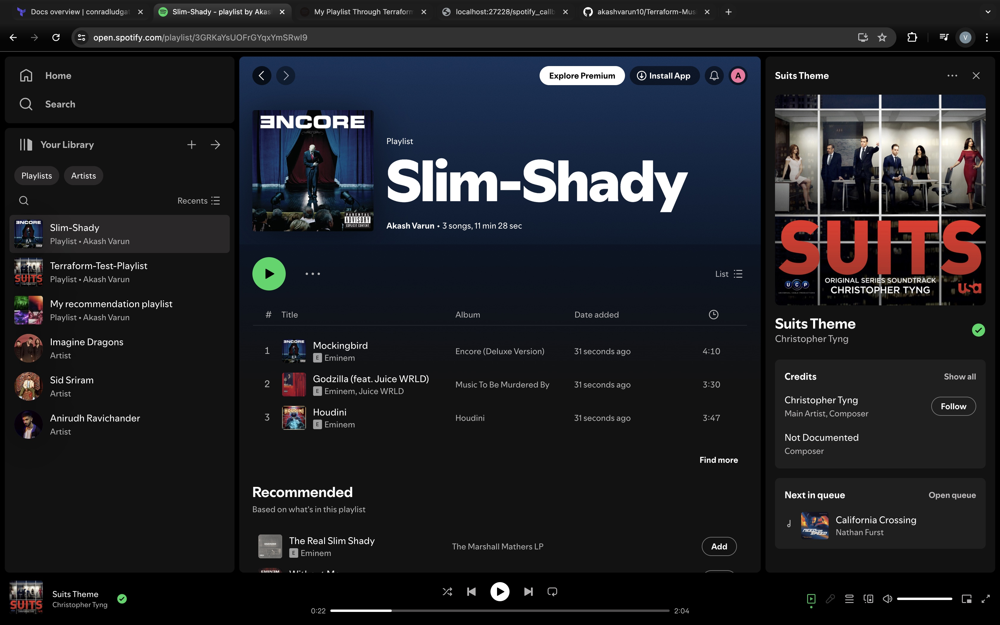
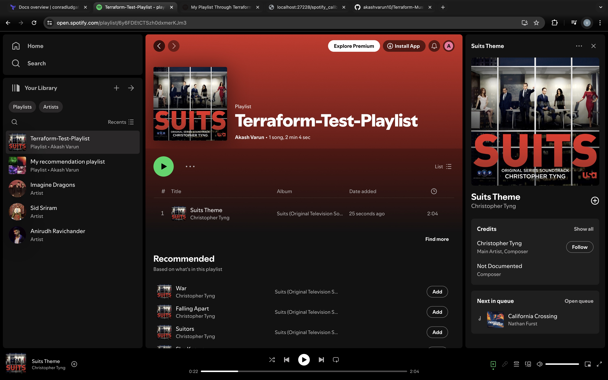

# Music Managing Via Terraform
# Spotify Playlist Creation with Terraform


### Fun Project with Terraform
This project involves using Terraform to automate the creation and management of multiple Spotify playlists for different occasions like morning, evening, party night, etc.



## Tech Stack and API-Keys Needed:

1. **Terraform Installed**: Ensure Terraform is installed on your machine.
2. **Docker Installed**: Make sure Docker is installed and running.
3. **Spotify Account**: You need a Spotify account (without premium access).
4. **Spotify Developer Account**: Register and create an application to get the Client ID and Client Secret.
5. **Spotify Provider for Terraform**: Install and configure the Spotify provider for Terraform.

## Steps to Complete the Project

### 1. Creating Terraform Code

Start by setting up your Terraform project.

1. Create a new directory for your Terraform project and navigate to it in your terminal.
2. Create a file named `provider.tf`.

### 2. Define Provider

In `variables.tf`, define the Spotify provider:

```hcl
variable "spotify_api_key" {
    type = string 
}
```

### 3. Obtain API Key

To interact with Spotify's API, you need a Client ID and Client Secret.

### 4. Create Spotify App

1. Go to the [Spotify Developer Dashboard](https://developer.spotify.com/dashboard/).
2. Log in with your Spotify account.
3. Click on "Create an App".
4. Fill in the required details and create the app.

| Name                         | Description                                   |
|------------------------------|-----------------------------------------------|
| My Playlist through Terraform | Create multiple Spotify playlists using Terraform. |

- Redirect URIs: `http://localhost:27228/spotify_callback`

5. Click on Settings and note down the `Client ID` and `Client Secret`.

### 5. Enter Details

Create a file named `.env` to store your Spotify application's Client ID and Secret:

```env
SPOTIFY_CLIENT_ID=<your_spotify_client_id>
SPOTIFY_CLIENT_SECRET=<your_spotify_client_secret>
```

### 6. Run the Spotify Auth App and Get the API Key

Make sure Docker Desktop is running, and start the authorization proxy server and running in your working directory or adjust the env path accordingly:

```sh
docker run --rm -it -p 27228:27228 --env-file .env ghcr.io/conradludgate/spotify-auth-proxy
```


Once you click the `Auth URL` and accept, You should get an “Authorization Successful” message.

Create a `terraform.tfvars` file and in that file 
```sh
spotify_api_key = "Your_Spotify_API_KEY"
```


### 7. Continue Creating Terraform Code

Update your `playlist.tf` to include the creation of Spotify playlists and adding tracks.

### 8. Initialize and Apply Terraform Configuration

1. Initialize the Terraform configuration:

```sh
terraform init
```

2. Plan the Terraform configuration to check the changes:

```sh
terraform plan
```

- Terraform Plan for Test Playlist:
  

- Terraform Plan for Artist Automation:
  


3. 

```sh
terraform apply -auto-approve
```

### 9. Verify Playlists on Spotify

After applying the Terraform configuration, log in to your Spotify account and verify that the playlists have been created and populated with the specified tracks.

- Terraform Automation for Artist:
  


- Terraform Test Playlist Creation:
  

## Conclusion

By following these steps, you can automate the creation and management of multiple Spotify playlists using Terraform. This approach not only saves time but also ensures consistency across your playlists. Customize the playlists and tracks as per your preference to suit different occasions.
